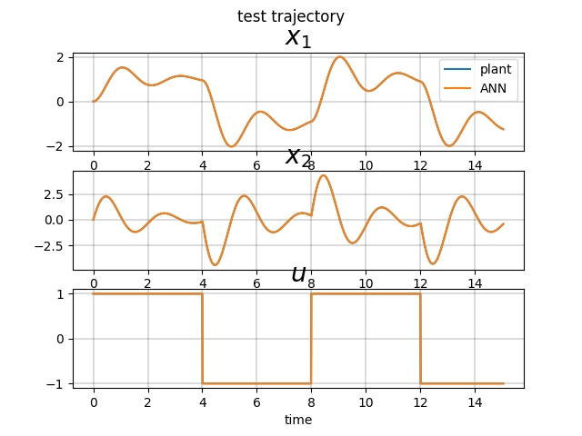

# Planar MIP Plant Identification

[code](https://github.com/poine/control_sandbox/blob/master/src/control_sandbox/planar_mip_ident.py)
<figure>
  
  <figcaption>Fig1. - SO LTI test trajectory, Full State Plant Identification.</figcaption>
</figure>
