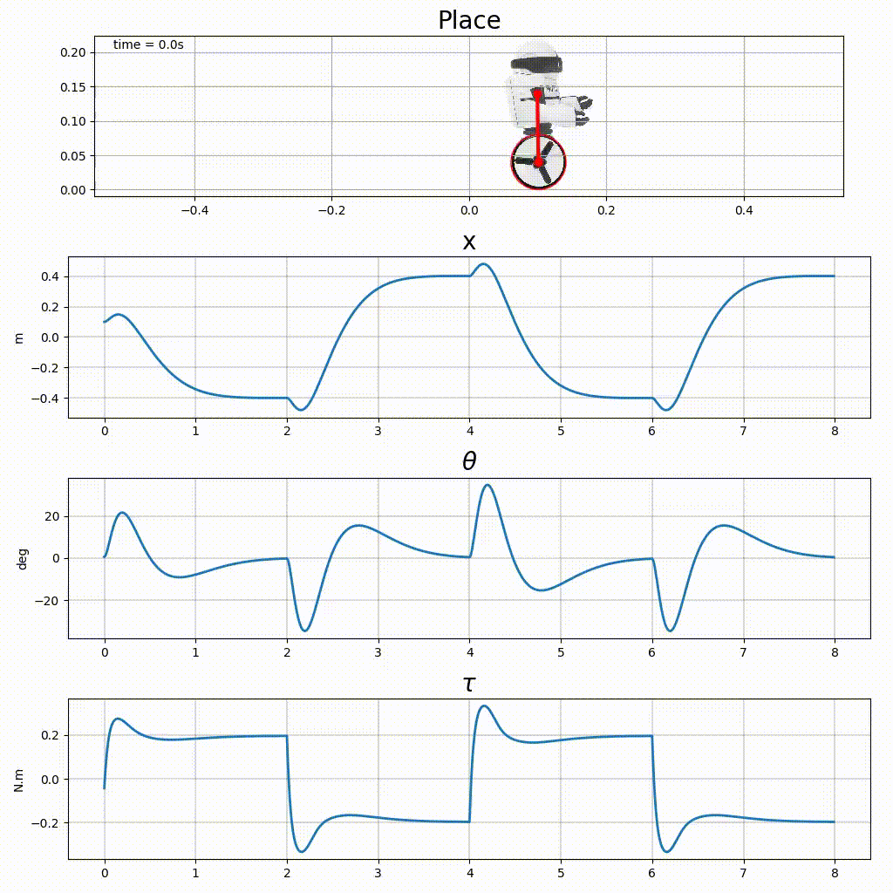
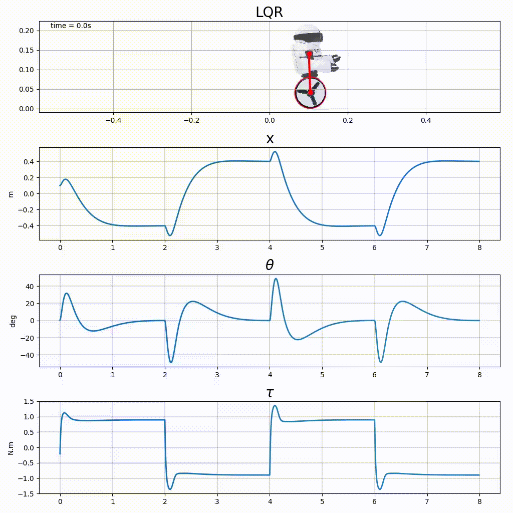
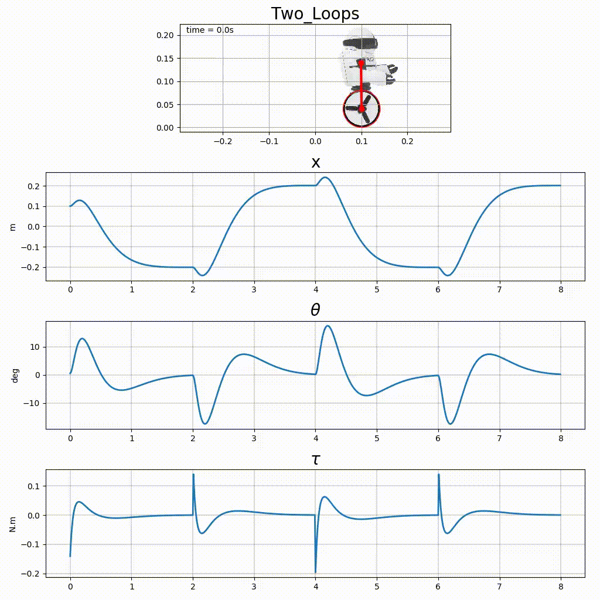

# Planar MIP Regulation
Some feedback control simulations for the planar MIP are available in the file  [planar_mip_control.py](https://github.com/poine/control_sandbox/blob/master/src/control_sandbox/planar_mip_control.py).

## Pole Placement

<figure>
	
	<figcaption>Fig3. -  Simulation of the planar MIP with a pole placement defined linear state feedback.</figcaption>
</figure>

## LQR

<figure>
	
	<figcaption>Fig3. -  Simulation of the planar MIP with a LQR defined linear state feedback.</figcaption>
</figure>

## Two Loops

<figure>
	
	<figcaption>Fig3. -  Simulation of the planar MIP with a dual loop structure.</figcaption>
</figure>

